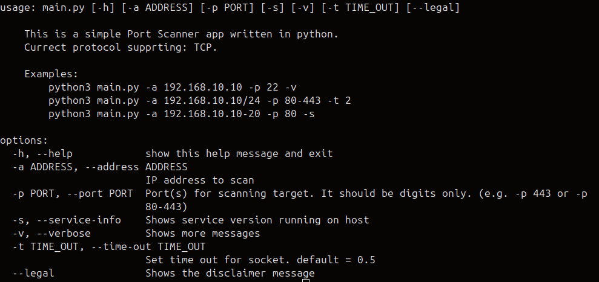

# port-xray

A Python-based port scanner tool that supports service version grabbing.

## Features

- Supports TCP scanning
- Supports service version grabbing
- Supports single and range IP scan
- CLI argument support with fallback to interactive mode

## Usage

Run the scanner interactively:

```bash
python3 main.py
```
Or pass command-line arguments:

```bash
python3 main.py -a 127.0.0.1 -p 80
```

## Arguments



## Planned Features

- Add support for UDP scanning

- Parallel (multi-threaded) scanning for speed
